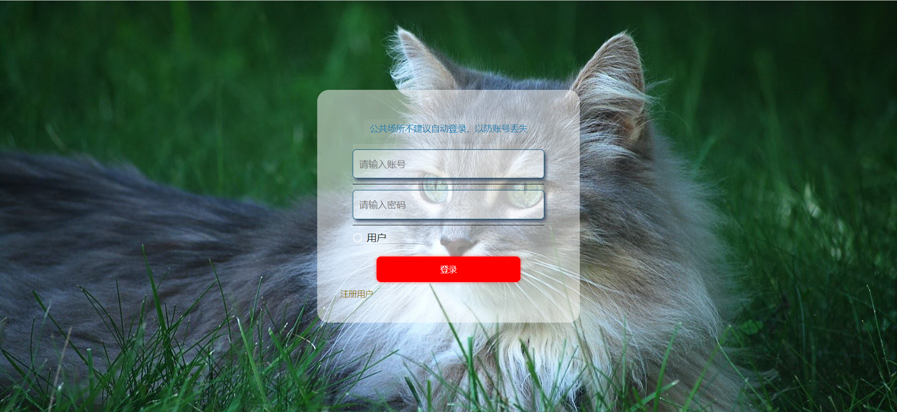
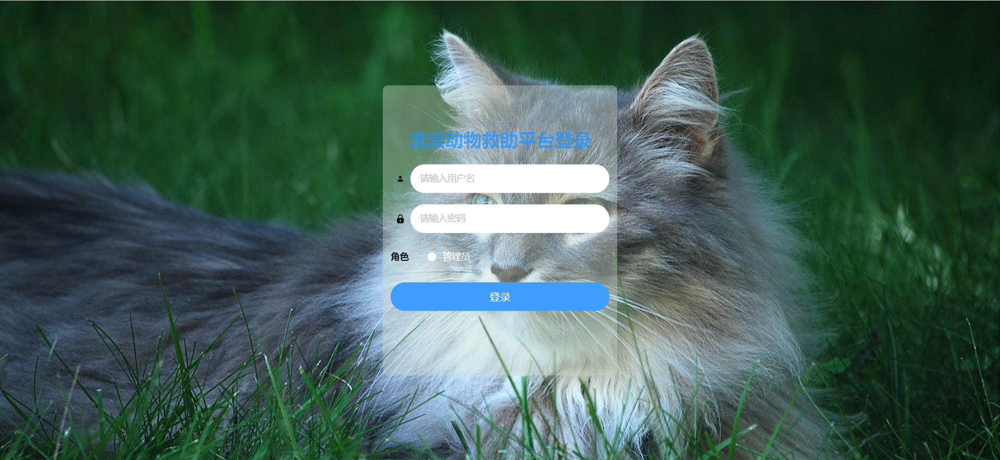
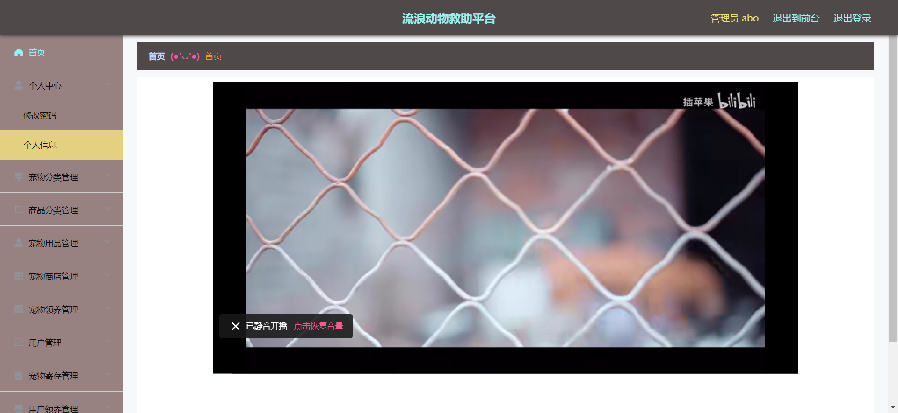

# 141.StrayAnimalRescuePlatformManagementSystem

<h1 align="center">141.流浪动物救助平台管理系统</h1>

	
    
    
    

## 简介

>访问路径
>
> http://localhost:8080/ssmqj7b0/front/index.html
>
> http://localhost:8080/ssmqj7b0/admin/dist/index.html#/index
>
> 密码 : abo abo

## 环境

- <b>IntelliJ IDEA 2020.3</b>

- <b>Mysql 5.7.26</b>

- <b>springboot</b>

- <b>JDK 1.8</b>

## 缩略图

